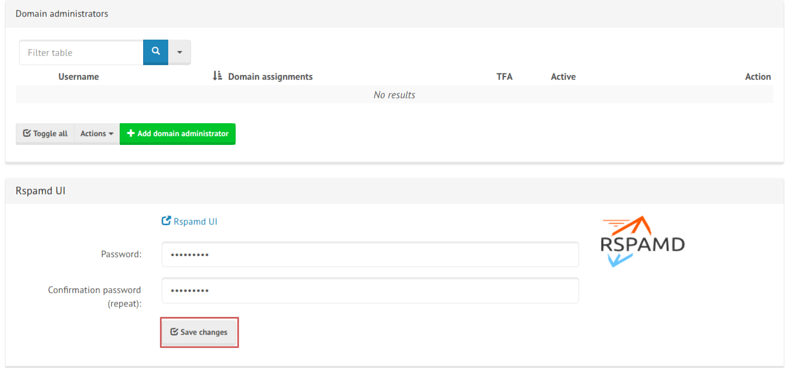

## **Rspamd Web UI**

[Rspamd] (https://rspamd.com/webui/) is an easy to use and fast spam filtering tool presently installed with `openemail` and running `rspmad-openemail`

**1\.**  Go to the openemail web admin interface

**2\.**  Navigate to the Access tab. Configuration -> Configuration & Detais -> Access tab

**3\.**  Modify the Rspamd UI password

**4\.**  Go to https://${OPENEMAIL_HOSTNAME}/rspamd in a browser and log in!

Additional configuration options and documentation can be found here : https://rspamd.com/webui/
