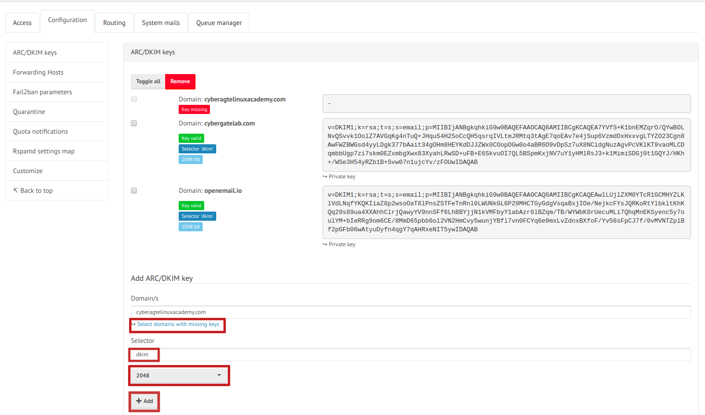

DNS infrastructure of the Internet plays a major role in email security today. Proper DNS setup for your email domain requires prior to setting up openemail for your domain.

Below you can find a list of **recommended DNS records**. While some are mandatory for a mail server (A, MX), others are recommended to build a good reputation score (TXT/SPF) or used for auto-configuration of mail clients (SRV).

## References

- A good article covering all relevant topics:
  ["3 DNS Records Every Email Marketer Must Know"](https://www.rackaid.com/blog/email-dns-records)
- Another great one, but Zimbra as an example platform:
  ["Best Practices on Email Protection: SPF, DKIM and DMARC"](https://wiki.zimbra.com/wiki/Best_Practices_on_Email_Protection:_SPF,_DKIM_and_DMARC)
- An in-depth discussion of SPF, DKIM and DMARC:
  ["How to eliminate spam and protect your name with DMARC"](https://www.skelleton.net/2015/03/21/how-to-eliminate-spam-and-protect-your-name-with-dmarc/)

## The minimal DNS configuration

Let's first first find your MX records using the `dig` command in your Linux system. Run the following query to view the MX records for the domain `openemail.io`. Simply change this domain to query MX for your domain.

```
dig openemail.io MX +short
```
You will get an output like below.
```
15 hasuna.openemail.io.
10 mail.openemail.io.
```
According to the above output the domain `openemal.io` has two `MX` records. The numbers `10` and `15` are respective `MX` priorities.

## Reverse DNS of your MX IP

Make sure that the PTR record of your IP matches the FQDN of your openemal host: `${OPENEMAIL_HOSTNAME}` [^1]. This record is usually set at the provider you leased the IP (server) from.

### To find the IP of your `MX` run:

```
$ dig mail.openemail.io +short
```
The above query should return an `IP` address like below.
```
68.183.186.231
```
### To find your PTR record run:
```
$ host  68.183.186.231
```
You will get an output like Below
```
231.186.183.68.in-addr.arpa domain name pointer mail.openemail.io
```

## DKIM, SPF and DMARC

The SPF, DKIM, and DMARC are setup as TXT in your DNS zone file. If you are running your own DNS for your domain you can add the following record in to your domains zone file like the example below.

```
@   IN    TXT   "v=spf1 mx -all"

```
### To find out your current SPF settings run:

```
$ dig TXT openemail.io
```
You will get an output like below.

```
"v=spf1  mx -all"
```
Using "v=spf1 mx -all" authorizes any IP that is also a MX for the sending domain. If you use `~all` ,it means softfail which allows mail whether or not it matches the parameters in the record.

Please refer to [SPF Project](http://www.openspf.org) for further reading.

### Creating a DKIM key and DNS records

It is highly recommended to create a **DKIM** TXT record in your **openemal UI##  and set the corresponding TXT record in your DNS records. Please refer to [OpenDKIM](http://www.opendkim.org) for further reading.

The below steps can be used to create DKIM key in you Linux command line in case if you are using your own mail server like postfix. You do not need to execute below. We have listed those commands to understand how the back-end has been configured for DKIM validations.

**Install required tools**
```
sudo apt-get install opendkim opendkim-tools
```
**Create the _domainkey**

Now create DKIM key pair using `opendkim-genkey` command line utility. For this guide we are using domain name `openemail.io`, Change this name with your actual domain name.
```
mkdir -p dkim-keys/openemail.io
cd dkim-keys/openemail.io
opendkim-genkey -t -s dkim -d openemail.io
cat dkim.txt
```
You will get an output like below. It is actually the TXT record for `bind` and compatible DNS servers.
```
dkim._domainkey	IN	TXT	( "v=DKIM1; h=sha256; k=rsa; t=y; "
	  "p=MIIBIjANBgkqhkiG9w0BAQEFAAOCAQ8AMIIBCgKCAQEAtIfYQWd16SotLpDAIe+9CRda6+KmExTSM4lQsO8XsbJsECqEuUer+xrJTVA4N5tEM53MeuH36tCjsKynlKMKmNQtMpblg3fHL0Z57FUyAUoHO9GOK1lS8vOA5wbf68FQ06YHAd/Dgq21/sYrERnnXYVvH5jSA44YBfiwrvuzopl/ekMp71WJMR73TmEQ1BTf6SZA6STvCJVj8d"
	  "pAuLekL1EYQzsGsp1kcOFYOee9c9VjfgkuZnJkAkQmz94L3YTd/08i6rZrKUSRXcx8dfitx7k12IrBsKCqlXgRIpWYWJW58gAM1Fif6gjDmugj4mAIQJ4oyWJdNDZPYpKEG+6VQQIDAQAB" )  ; ----- DKIM key dkim for openemail.io
```
### Creating DKIM key in openemal UI



Do the following step  which are marked in red color

**1\.** Click on `Select domains with missing keys`

**2\.** Set dkim key lenths as '2048'

**3\.** Press `Add` button

```
$ dig TXT _dmarc.openemail.io  +short
```
You will get an output like below.
```
"v=DMARC1; p=quarantine; pct=5; rua=mailto:postmaster@openemail.io"
```
The corresponding DNS zone file entry that we have added for this purpose is like below. You can do the same thing for your domain.
```
_dmarc    IN    TXT   "v=DMARC1; p=quarantine; pct=5; rua=mailto:postmaster@openemail.io"

```
## The advanced DNS configuration

**SRV** records specify the server(s) for a specific protocol on your domain. If you want to explicitly announce a service as not provided, give "." as the target address (instead of "mail.example.org."). Please refer to [RFC 2782](https://tools.ietf.org/html/rfc2782). for more details.

```
_imap._tcp          IN SRV     0 1 143   mail.example.org.
_imaps._tcp         IN SRV     0 1 993   mail.example.org.
_pop3._tcp          IN SRV     0 1 110   mail.example.org.
_pop3s._tcp         IN SRV     0 1 995   mail.example.org.
_submission._tcp    IN SRV     0 1 587   mail.example.org.
_smtps._tcp         IN SRV     0 1 465   mail.example.org.
_sieve._tcp         IN SRV     0 1 4190  mail.example.org.
_autodiscover._tcp  IN SRV     0 1 443   mail.example.org.
_carddavs._tcp      IN SRV     0 1 443   mail.example.org.
_carddavs._tcp      IN TXT     "path=/SOGo/dav/"
_caldavs._tcp       IN SRV     0 1 443   mail.example.org.
_caldavs._tcp       IN TXT     "path=/SOGo/dav/"
```

## Testing for SPF, DKIM, and DMARC

Here are some tools you can use to verify your DNS configuration:

- [MX Toolbox](https://mxtoolbox.com/SuperTool.aspx) (DNS, SMTP, RBL)
- [port25.com](https://www.port25.com/dkim-wizard/) (DKIM, SPF)
- [Mail-tester](https://www.mail-tester.com/) (DKIM, DMARC, SPF)
- [DMARC Analyzer](https://www.dmarcanalyzer.com/spf/checker/) (DMARC, SPF)

## Getting additional statistics

If you are interested in statistics, you can additionally register with the [Postmaster Tool](https://gmail.com/postmaster)  by Google and supply a **google-site-verification** TXT record, which will give you details about spam-classified mails by your domain. This is clearly optional. You can add a TXT records in your DNS server like the one below.

```
@                   IN TXT     "google-site-verification=..."
```

[^1]: A **Fully Qualified Domain Name** (**FQDN**) is the complete (absolute) domain name for a specific computer or host, on the Internet. The FQDN consists of at least three parts divided by a dot: the hostname (myhost), the domain name (mydomain) and the top level domain in short **tld** (com). In the example of `mx.openemail.io` the hostname would be `mx`, the domain name 'openemal' and the tld is `io`.
